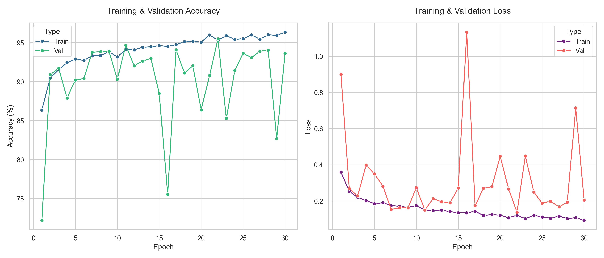

# HER2 Classification - Experiment Log

This file documents the experimental process, performance metrics, and decision-making logic for the HER2 breast cancer tissue classification project.

---

## Phase 1: Baseline Training (Completed)

The objective of Phase 1 was to establish a performance baseline using a standard pre-trained architecture and default hyperparameters.

### Configuration
* **Architecture**: ResNet50 (Pre-trained on ImageNet)
* **Optimizer**: Adam
* **Learning Rate**: 0.001
* **Batch Size**: 32
* **Input Size**: 224x224
* **Epochs**: 30 (Stopped due to early signs of overfitting and plateau)

### Performance Summary
Key metrics recorded during the baseline training process:

| Epoch | Train Acc | Val Acc | Train Loss | Val Loss | Status/Notes |
| :--- | :---: | :---: | :---: | :---: | :--- |
| 1 | 86.39% | 72.23% | 0.3601 | 0.9006 | Start (Initial Weights) |
| 7 | 93.32% | 93.77% | 0.1752 | 0.1533 | Initial Stabilization |
| 11 | 94.13% | 94.68% | 0.1510 | 0.1505 | High Precision reached |
| 16 | 94.53% | 75.55% | 0.1344 | 1.1335 |  **Instability (LR Spike)** |
| 22 | 95.32% | **95.50%** | 0.1215 | 0.1381 | **Picked Baseline Checkpoint** |
| 29 | 95.94% | 82.68% | 0.1077 | 0.7143 | Numerical Divergence |
| 30 | 96.36% | 93.64% | 0.0933 | 0.2061 | End of Baseline Phase |

> Full raw execution logs are available at: `results/logs/training_logs_phase1.txt`

### Visual Analysis

### Key Observations & Analysis
| Observation | Impact & Technical Context |
| :--- | :--- |
| **High Variance** | Significant accuracy drops (e.g., Ep 16, 29) indicate that $LR=1e^{-3}$ is too aggressive for stable convergence in later stages. |
| **Feature Robustness** | The model demonstrated strong recovery capabilities after gradient spikes, suggesting high-quality feature extraction. |
| **Training Saturation** | Training accuracy peaked at 96.36% while validation oscillated, indicating an architectural/hyperparameter ceiling for this phase. |

**Conclusion:** Baseline training successfully identified a high-performing weights state at Epoch 22. Transitioning to Fine-tuning to refine weights and stabilize accuracy.

---

##  Phase 2: Fine-tuning (In Progress)

This phase aims to "smooth" the loss landscape and achieve higher precision by slowing down weight updates.

* **Starting Point**: Checkpoint `best_model_phase1.pth` (Epoch 22, 95.50%)
* **Strategy**: Reduce Learning Rate to **0.0001** ($10^{-4}$) to refine convergence.
* **Goal**: Stabilize Validation Accuracy above 96.0% and minimize Loss volatility.

### Current Status: 
*Awaiting Phase 2 results...*