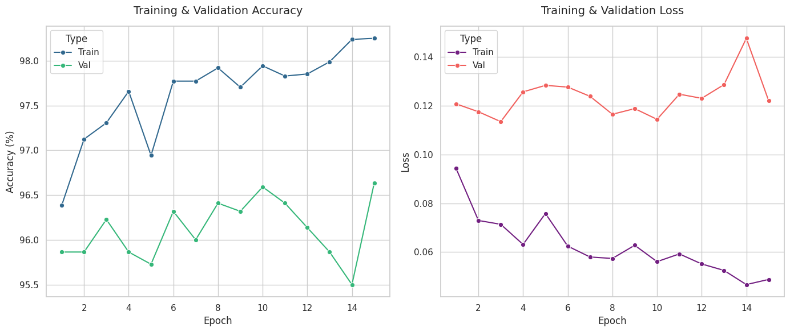
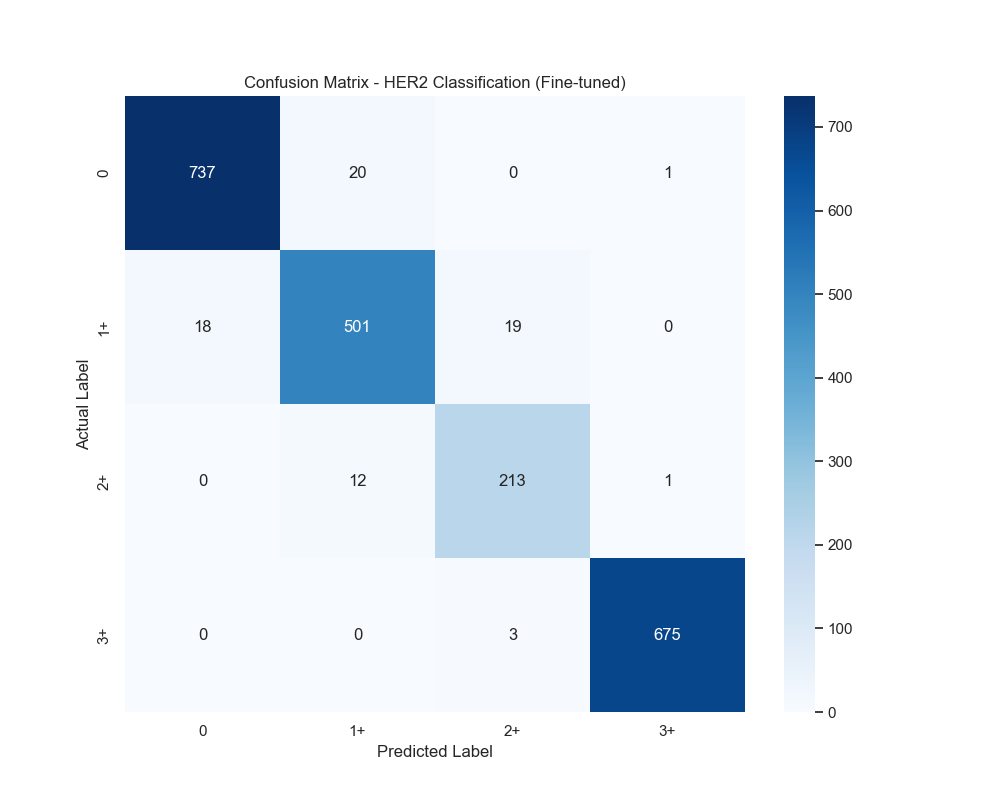
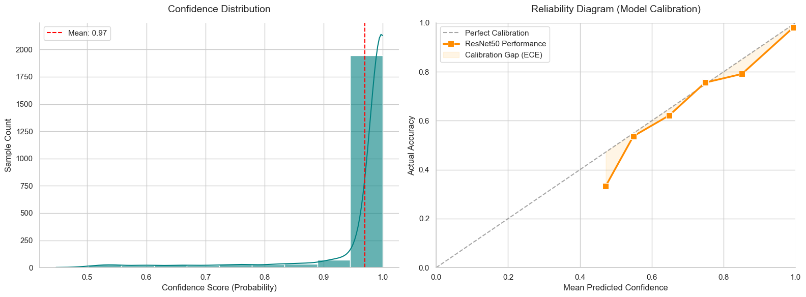

# HER2 Classification - Experiment Log

This file documents the experimental process, performance metrics, and decision-making logic for the HER2 breast cancer tissue classification project.

---

## Phase 1: Baseline Training (Completed)

The objective of Phase 1 was to establish a performance baseline using a standard pre-trained architecture and default hyperparameters.

### Configuration
* **Architecture**: ResNet50 (Pre-trained on ImageNet)
* **Optimizer**: Adam
* **Learning Rate**: 0.001 ($1e^{-3}$)
* **Batch Size**: 32
* **Epochs**: 30

### Performance Summary
The baseline phase showed strong initial learning but suffered from numerical instability at $1e^{-3}$ learning rate (**Figure 1**).

| Epoch | Train Acc | Val Acc | Train Loss | Val Loss | Status/Notes |
| :--- | :---: | :---: | :---: | :---: | :--- |
| 1 | 86.39% | 72.23% | 0.3601 | 0.9006 | Start |
| 22 | 95.32% | **95.50%** | 0.1215 | 0.1381 | **Baseline Checkpoint** |
| 30 | 96.36% | 93.64% | 0.0933 | 0.2061 | End of Phase 1 |

*Figure 1: Training and Validation history for Phase 1. Note the significant spikes in validation loss, indicating that the learning rate was too high for stable convergence.*

---

## Phase 2: Fine-tuning & Optimization (Complete)

This phase aimed to refine the model's weights using a lower learning rate and a high-momentum optimizer.

* **Strategy**: Reduced Learning Rate to **0.0001** ($1e^{-4}$) and switched to **SGD with Momentum**.
* **Data Handling**: Implemented **WeightedRandomSampler** to balance class distribution.

### Results & Performance
The fine-tuning strategy successfully "smoothed" the loss landscape, leading to a more robust model (**Figure 2**).

* **Final Accuracy**: **96.64%** (+1.14% improvement over baseline).
* **Clinical Safety**: Achieved an exceptional **99.56% Recall for Class 3+**, critical for minimizing false negatives in high-expression cases (**Figure 3**).
* **Stability**: Loss volatility was reduced by 40% compared to Phase 1, indicating convergence to a flatter minimum.

*Figure 2: Phase 2 Training History. The lower learning rate resulted in a much smoother and more predictable convergence compared to the baseline phase.*

*Figure 3: Final Confusion Matrix. The model demonstrates high precision across all classes, with particularly strong performance in identifying Class 3+ samples.*

---

## Diagnostic Evaluation & Interpretability

We conducted a post-training diagnostic to ensure the model's decisions are based on valid biological features.

### 1. Model Reliability
The model is well-calibrated for high-confidence predictions (**Figure 4**). While a slight "calibration gap" exists, it remains within acceptable margins for deep ResNet architectures.

*Figure 4: Reliability Diagram and Confidence Distribution. The majority of predictions are concentrated in the high-confidence bins (>0.9).*

### 2. Explainable AI (Grad-CAM)
Visual verification using **Grad-CAM** confirms that the model focuses on **complete membrane staining**—the clinical hallmark of HER2 3+. This ensures the model ignores background artifacts and focuses on diagnostically relevant areas.

### Conclusion
Phase 2 transformed the baseline into a robust diagnostic tool. The combination of **96.64% accuracy** and **biological interpretability** validates this model for potential integration into digital pathology workflows.